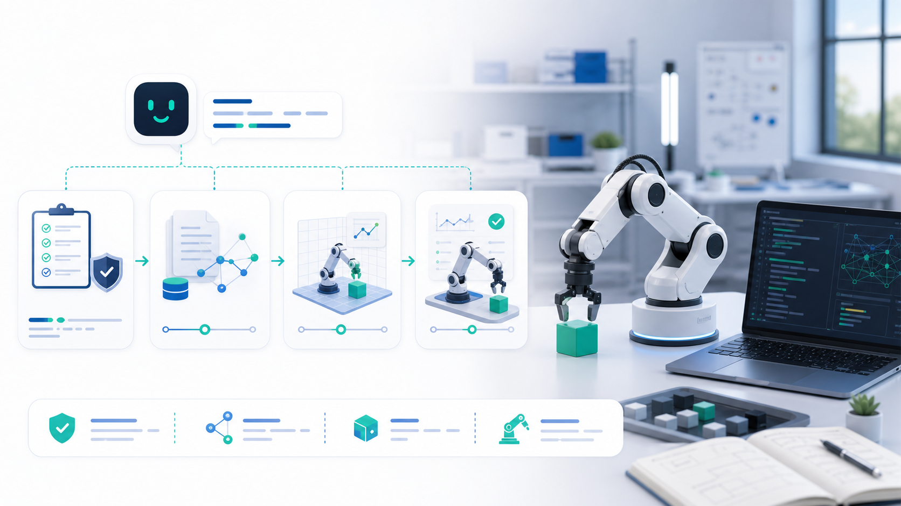
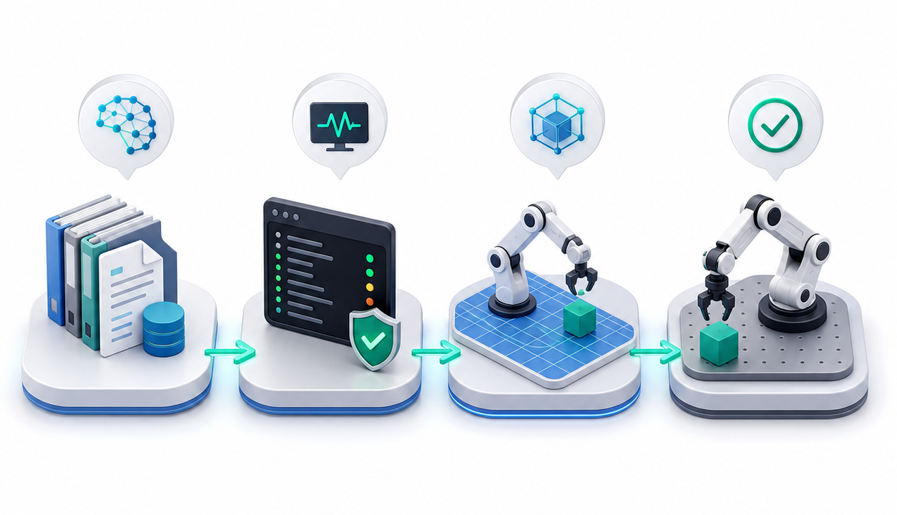

# LeRobot Assistant Skill



[English README](README.md)

`lerobot-assistant` 是一个面向 LeRobot 机器人学习工作流的 Agent Skill。它帮助 AI Agent 诊断本地环境、检索 LeRobot v0.5.1 本地知识库、引导 SO-101/S101 配置，并以更安全的方式生成安装、遥操作、数据录制、训练和故障排查步骤。

这个仓库按自包含 Skill 文件夹组织：根目录包含 `SKILL.md`，旁边打包了脚本、模板、测试和参考资料。

## 能力概览

- 检测 Python、conda/mamba、Git、LeRobot、PyTorch、GPU、ffmpeg、USB 串口设备和 Hugging Face CLI。
- 将 LeRobot 问题路由到 58 个本地知识文件，内容基于 Hugging Face LeRobot v0.5.1 文档整理。
- 提供可渲染的 SO-101/S101 配置模板。
- 对硬件操作、`sudo`、包安装、Hub 上传、固件更新和长时间训练给出安全边界。
- 包含 pytest 和 shell 测试，便于上传、安装或二次开发前验证 Skill 可用性。

## 项目结构

```text
lerobot-assistant/
├── SKILL.md                    # Skill 入口文件
├── README.md
├── README-ch.md
├── LICENSE
├── SECURITY.md
├── THIRD_PARTY_NOTICES.md
├── config.yaml                 # 版本、URL、安装 profile 与机器人元数据
├── pyproject.toml              # pytest 配置
├── requirements-dev.txt
├── assets/                     # README 插图
├── scripts/
│   ├── env_check.sh            # 人类可读/JSON 环境诊断
│   └── render_so101_config.py  # SO-101/S101 模板渲染器
├── templates/
│   └── so101_config.yaml
├── references/
│   ├── knowledge_index.md
│   └── knowledge/              # 58 个本地知识文件
└── tests/
    ├── test_env_check.py
    ├── test_project_metadata.py
    ├── test_so101_template.py
    └── shell_env_check.sh
```

## 作为 Skill 安装

对于 Claude 或其他兼容 Agent Skills 的客户端，可以将整个仓库文件夹作为自定义 Skill 上传或安装。必需入口文件是：

```text
SKILL.md
```

Skill 本身被加载时不需要专门的 Python 环境。只有运行内置诊断脚本、测试或真实 LeRobot 命令时才需要 Python。

## LeRobot 运行环境

真实使用 LeRobot 时，建议创建干净的 Python 3.12 环境：

```bash
conda create -n lerobot python=3.12 -y
conda activate lerobot
pip install "lerobot[all]==0.5.1"
```

如果需要源码开发：

```bash
git clone https://github.com/huggingface/lerobot.git
cd lerobot
pip install -e ".[all]"
```

## 环境诊断

```bash
bash scripts/env_check.sh
bash scripts/env_check.sh --json
```

退出码含义：

- `0`：所有检查通过。
- `1`：存在警告，轻量工作流可继续。
- `2`：存在必须修复的问题，通常是 Python 缺失或低于 3.12。

## SO-101/S101 配置模板


渲染内置 SO-101/S101 配置模板：

```bash
python3 scripts/render_so101_config.py \
  --robot-id demo_so101 \
  --robot-port /dev/ttyUSB0 \
  --teleop-port /dev/ttyUSB1 \
  --dataset-repo-id USER/so101_dataset
```

## 常用 LeRobot 命令

```bash
# 遥操作 SO-101
lerobot-teleoperate \
  --robot.type=so101_follower \
  --robot.port=/dev/ttyUSB0 \
  --robot.id=my_so101 \
  --teleop.type=so101_leader \
  --teleop.port=/dev/ttyUSB1 \
  --teleop.id=my_so101_leader

# 录制小规模数据集
lerobot-record \
  --robot.type=so101_follower \
  --robot.port=/dev/ttyUSB0 \
  --robot.id=my_so101 \
  --teleop.type=so101_leader \
  --teleop.port=/dev/ttyUSB1 \
  --teleop.id=my_so101_leader \
  --dataset.repo_id=USER/so101_test \
  --dataset.num_episodes=5

# 训练 ACT
lerobot-train \
  --dataset.repo_id=USER/so101_test \
  --policy.type=act \
  --policy.device=cuda
```

## 先仿真评估，再真机测试



多数机器人学习算法都应先在虚拟环境中评估，再迁移到真实机械臂。这个 Skill 已包含 LIBERO 和 Meta-World 的本地参考：

- LIBERO：`references/knowledge/04_模拟/04_LIBERO.md`
- Meta-World：`references/knowledge/04_模拟/05_MetaWorld.md`

推荐的保守流程：

1. 运行 `bash scripts/env_check.sh --json`，先修复必须失败项。
2. 训练或加载一个与目标任务兼容的 policy。
3. 在 LIBERO 或 Meta-World 中先进行短时仿真评估。
4. 检查成功率、失败模式、视频输出、动作尺度以及 observation/action 字段。
5. 仿真 smoke test 通过后，再进行低速、短时 SO-101/S101 真机验证。
6. 在确认数据隐私和仓库权限前，保持 `push_to_hub` 关闭。

不同 LeRobot 环境和 benchmark 的具体命令会随依赖安装方式变化。下面的命令只作为工作流锚点，不保证可以在所有机器上直接复制运行：

```bash
# 安装较完整的 LeRobot 可选依赖，用于本地实验。
pip install "lerobot[all]==0.5.1"

# 运行 benchmark 前先阅读本地参考。
sed -n '1,160p' references/knowledge/04_模拟/04_LIBERO.md
sed -n '1,160p' references/knowledge/04_模拟/05_MetaWorld.md

# 首次评估保持短流程，并先检查日志/视频，再进入硬件测试。
lerobot-record --help
lerobot-train --help
```

从仿真迁移到 SO-101/S101 时，请重点核对相机名称、动作维度、归一化统计量、控制频率、关节限位和急停方案。不要把未经验证的仿真策略直接运行到真实硬件上。

## 测试

```bash
python3 -m pip install -r requirements-dev.txt
python3 -m pytest
bash tests/shell_env_check.sh
```

测试覆盖：

- `SKILL.md` 是否引用了存在的内置资源。
- 环境诊断 JSON 是否可被机器解析。
- 知识库索引是否匹配 58 个本地知识文件。
- 每个知识文件是否包含来源标记。
- SO-101/S101 模板是否可渲染。

## 安全

这个仓库不应包含凭证或私有机器人配置。内置诊断脚本是只读的，SO-101/S101 模板默认 `push_to_hub: false`。

发布前请阅读 [SECURITY.md](SECURITY.md)，并运行其中列出的密钥扫描和危险命令扫描。

## 来源

本地知识库基于：

- Hugging Face LeRobot 文档索引：https://huggingface.co/docs/lerobot/index
- LeRobot v0.5.1 文档页面
- Hugging Face LeRobot GitHub 仓库：https://github.com/huggingface/lerobot

本项目与 Hugging Face 或 LeRobot 维护者无隶属关系。

## 发布检查

上传到 GitHub 前建议运行：

```bash
git status --short
python3 scripts/security_scan.py
python3 -m pytest
bash tests/shell_env_check.sh
```

不要提交 `__pycache__/`、`.pytest_cache/` 等生成缓存。
